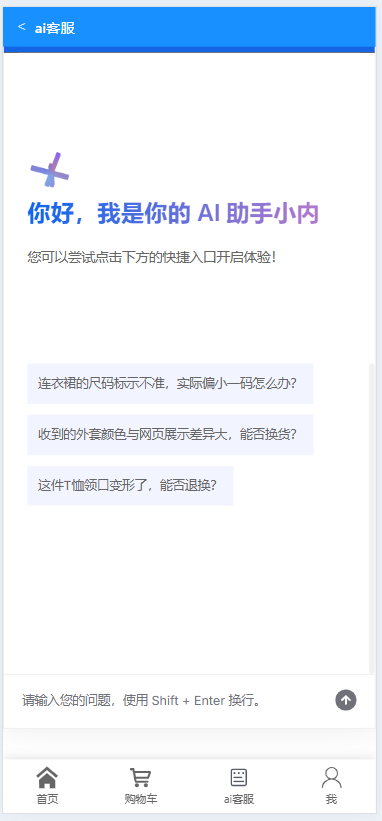
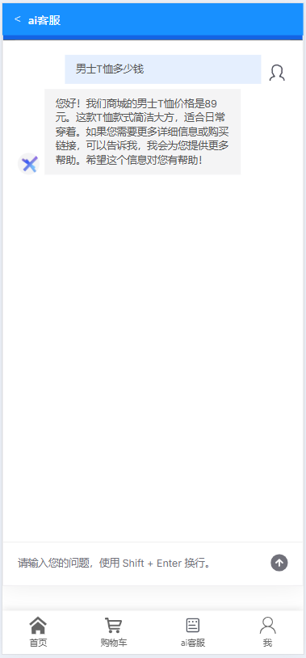
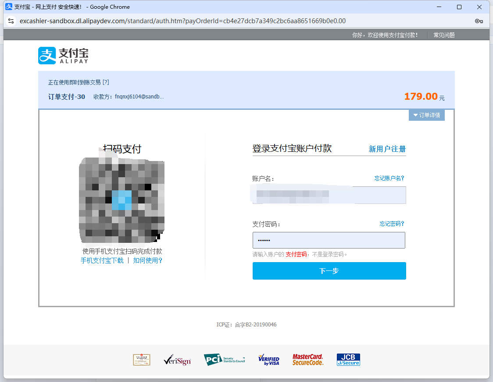
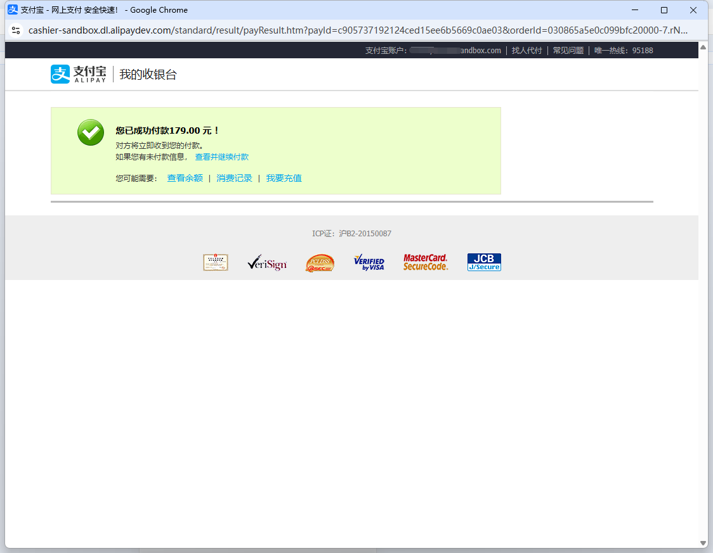

# 商城用户端前端项目

## 项目概述
本项目是电商平台的前端部分，基于Vue 3和Vite构建，实现了商品展示、用户管理、购物车、订单管理、支付宝沙箱支付以及AI客服（deepseek部署）等功能。项目采用前后端分离架构，通过HTTP请求与后端Spring Boot应用交互。

## 技术栈

### 前端核心技术
- **Vue 3**: 核心前端框架
- **Vite**: 构建工具
- **Vue Router**: 路由管理
- **Pinia**: 状态管理
- **Element Plus**: UI组件库
- **Axios**: HTTP客户端
- **EventSource**: 实现AI客服SSE流式响应

### 样式与UI
- **SCSS**: CSS预处理器
- **Tailwind CSS**: 原子化CSS框架
- **Font Awesome**: 图标库

### 开发工具
- **ESLint**: 代码规范检查
- **Prettier**: 代码格式化
- **TypeScript**: 类型检查（部分组件）

## 功能模块

### 1. 用户管理
- 用户注册与登录界面
- 个人信息管理页面
- JWT认证状态管理

### 2. 商品展示
- 首页商品轮播展示
- 商品分类浏览
- 商品搜索功能
- 商品详情页面

### 3. 购物车
- 购物车商品管理
- 商品数量调整
- 购物车结算功能
- 本地存储与服务器同步

### 4. 订单管理
- 订单创建流程
- 订单状态展示
- 订单历史查询
- 订单详情页面

### 5. 支付功能

#### 支付宝沙箱支付集成

前端支付功能与后端支付宝沙箱环境对接，实现了完整的支付流程：

- **支付流程**：
  - 订单确认页面展示
  - 支付方式选择
  - 支付表单生成与跳转
  - 支付结果页面展示

- **技术实现**：
  - 表单提交方式对接支付宝接口
  - 支付状态轮询检查
  - 支付结果页面自动跳转

- **用户体验优化**：
  - 支付加载状态提示
  - 支付结果清晰展示
  - 支付失败错误处理

### 6. AI客服系统

#### 前端实现
AI客服系统前端基于EventSource实现了与后端的SSE通信，具有以下特点：

- **流式响应UI**: 实现打字机效果的实时文本显示
- **会话管理**: 保存用户与AI的对话历史
- **响应式设计**: 适配不同设备屏幕尺寸

#### 核心代码
```javascript
// AI客服SSE连接实现
function connectToAIService(prompt) {
  const eventSource = new EventSource(`/api/chat?prompt=${encodeURIComponent(prompt)}`);
  
  eventSource.addEventListener('result', (event) => {
    const data = JSON.parse(event.data);
    // 处理流式响应数据
    updateChatUI(data.output.content);
    
    if (data.output.finishReason === 'stop') {
      eventSource.close();
    }
  });
  
  eventSource.onerror = (error) => {
    console.error('SSE连接错误:', error);
    eventSource.close();
  };
}
```

#### 功能特点
- **实时对话**: 用户输入即时响应
- **历史记录**: 保存当前会话的对话历史
- **智能推荐**: 展示AI推荐的相关商品
- **用户引导**: 提供常见问题快捷入口

## 项目结构
```
src/
├── assets/         # 静态资源
├── components/     # 通用组件
├── views/          # 页面视图
├── router/         # 路由配置
├── store/          # 状态管理
├── api/            # API请求
├── utils/          # 工具函数
└── App.vue         # 根组件
```

## 开发环境搭建
1. 克隆项目到本地
```bash
git clone <项目仓库地址>
```

2. 安装依赖
```bash
npm install
```

3. 启动开发服务器
```bash
npm run dev
```

4. 构建生产版本
```bash
npm run build
```

## 部署信息
- 项目访问地址: http://121.41.108.215:5173/

- （网址打开不了就是服务器到期了ξ( ✿＞◡❛)，希望大家尽量不要进行修改删除操作，谢谢大家的配合(´・ω・`)。若数据遭到恶意修改删除请联系管理员QQ:1411498103）

- 服务器管理不易，如果觉得项目对您有益，请支持多多一下我们，谢谢(✿◠‿◠)

  

## 项目截图

### AI客服功能演示


### AI客服功能演示2


### 支付功能


### 支付结果


### 商品展示


## 贡献者
- 开发团队

## 许可证
MIT License
